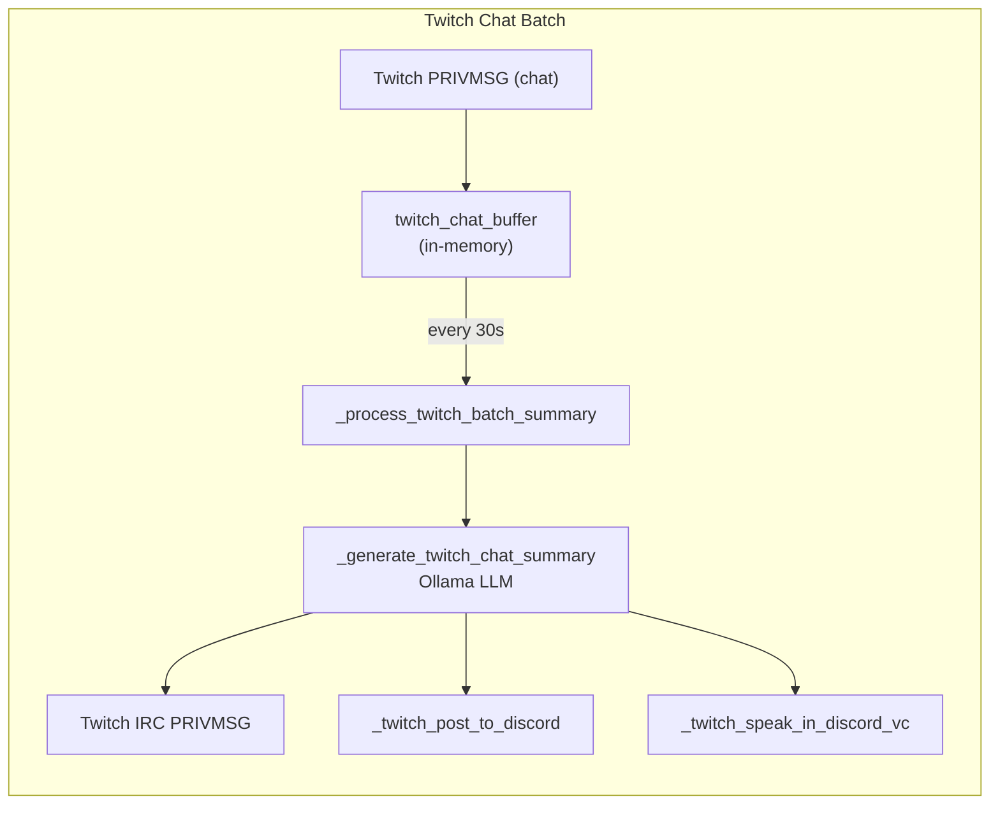

# Luna Message Data Flow Diagram

This diagram shows all modules affected when a message is received and processed.

## Main Flow: Discord / Twitch Notification Messages

```mermaid
flowchart TB
    subgraph ENTRY["📥 Message Entry Points"]
        DISCORD["Discord on_message"]
        TWITCH_NOTIF["Twitch USERNOTICE/PRIVMSG<br/>(subs, bits, donations)"]
    end

    subgraph ROUTING["Message Routing"]
        DISCORD --> PROC_DISCORD["_process_discord_message"]
        TWITCH_NOTIF --> PROC_TWITCH["_process_twitch_message"]
    end

    subgraph CORE["generate_response (Core Pipeline)"]
        GEN["generate_response"]
    end

    PROC_DISCORD --> GEN
    PROC_TWITCH --> |pre-written response| TWITCH_OUT["Twitch IRC + Discord + VC"]
    PROC_DISCORD --> GEN

    subgraph CONTEXT["Context & Pre-Processing"]
        GEN --> UPD_GLOBAL["_update_global_context"]
        UPD_GLOBAL --> |writes| GLOBAL_CTX["global_context (in-memory)<br/>+ save_user_profile"]
        UPD_GLOBAL --> |reads/writes| DNA_PROFILE["luna_dna_memory.db<br/>user_profiles"]
        
        GEN --> |if URLs| EXTRACT_URL["extract_urls_from_text"]
        EXTRACT_URL --> CRAWL["crawl_website"]
        CRAWL --> ANALYZE_WEB["analyze_webpage_content"]
        ANALYZE_WEB --> WEB_CTX["web_context"]
        
        GEN --> |dm command| SEND_DM["send_discord_dm"]
        GEN --> |improve/reflect| SELF_MOD["SelfModificationEngine"]
        GEN --> |understand X| UNDERSTAND["UnderstandingEngine<br/>luna_understanding.db"]
        GEN --> |learn from this| CONTINUOUS["ContinuousLearningEngine<br/>luna_knowledge_base.json"]
    end

    subgraph MEMORY["Memory & Recall"]
        GEN --> RECALL["recall_dna_memories /<br/>recall_dna_memories_with_vector_reasoning"]
        RECALL --> |reads| DNA_DB["luna_dna_memory.db<br/>memory_strands"]
        RECALL --> |if vector| VECTOR["luna_vector_reasoning.db<br/>reason_with_vectors"]
        
        GEN --> MEM_SEARCH["search_and_inject_memories<br/>luna_memory_search.py"]
        MEM_SEARCH --> |reads| DNA_FACTS["luna_dna_memory.db<br/>user_facts, user_profiles"]
        MEM_SEARCH --> |reads| DNA_RECALL["recall_dna_memories"]
    end

    subgraph SEARCH["Search & Time Context"]
        GEN --> |time/date query| GET_DATETIME["get_current_datetime"]
        GEN --> |time in X| GET_LOC_TIME["get_time_for_location"]
        GEN --> |local info| GET_LOCAL["get_local_info"]
        GEN --> |web search| SEARCH_GOOGLE["search_google<br/>Playwright"]
    end

    subgraph PROMPT["Prompt Assembly"]
        GEN --> CORE_PROMPT["get_core_prompt"]
        GEN --> AUTONOMOUS["_get_autonomous_context"]
        GEN --> ASSEMBLE["Assemble: system + memory +<br/>vector_insights + global + web +<br/>search + autonomous"]
    end

    subgraph LLM["Response Generation"]
        ASSEMBLE --> OLLAMA["Ollama LLM<br/>qwriko3-4b"]
        OLLAMA --> REPLY["reply"]
    end

    subgraph POST["Post-Response (Write-Back)"]
        REPLY --> SAVE_DNA["save_dna_memory"]
        SAVE_DNA --> |stores strand| DNA_DB
        SAVE_DNA --> |extract_facts| EXTRACT_FACTS["_extract_facts_from_message"]
        EXTRACT_FACTS --> |save_user_fact| DNA_FACTS
        SAVE_DNA --> |save_user_profile| DNA_PROFILE
        
        REPLY --> UPD_AUTO["_update_autonomous_state"]
        REPLY --> RECORD_LEARN["continuous_learning.record_interaction<br/>luna_learning_data.jsonl"]
    end

    subgraph OUTPUT["Output"]
        REPLY --> DISCORD_SEND["Discord channel.send"]
        REPLY --> VC_SPEAK["_discord_speak_in_vc_smart<br/>Edge TTS / Lux"]
    end

    PROC_DISCORD --> OUTPUT
```

## Twitch Chat Batch Flow (30s summaries)

## Storage Files Affected by a Message

| File | When Affected |
|------|---------------|
| **luna_dna_memory.db** | Memory strands, user_facts, user_profiles (save_dna_memory, _update_global_context) |
| **luna_vector_reasoning.db** | Vector recall when `recall_dna_memories_with_vector_reasoning` is used |
| **luna_understanding.db** | Only when "understand X" command is used |
| **luna_knowledge_base.json** | Continuous learning (record_interaction) |
| **luna_learning_data.jsonl** | Continuous learning (record_interaction) |
| **In-memory (global_context)** | Cross-platform users, user_profiles, channel_conversations, active_topics |

## Module Summary

| Module | File | Role |
|--------|------|------|
| **luna_clean** | luna_clean.py | Orchestrator: message routing, generate_response, VC, Discord/Twitch I/O |
| **luna_dna_memory** | luna_dna_memory.py | Persistent memory: strands, facts, profiles |
| **luna_memory_search** | luna_memory_search.py | Injects memories + facts into prompt |
| **luna_vector_reasoning** | luna_vector_reasoning.py | Semantic vector search over memories |
| **luna_understanding** | luna_understanding.py | Concept maps, introspection (command-triggered) |
| **luna_continuous_learning** | luna_continuous_learning.py | Records interactions, knowledge extraction |
| **luna_curiosity_engine** | luna_curiosity_engine.py | Background curiosity (not per-message) |
| **Ollama** | External | LLM inference |
